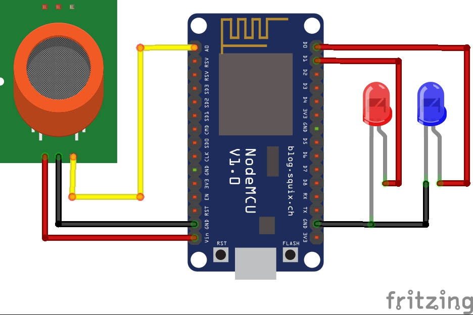

# Gas-leakage-detection
Nowadays, gas leakages are a bit common in home and restaurants and their detection is getting difficult.
As we all know lpg gas is highly flammable and can cause fire accidents so their detection and evacuation becomes very important to us.
In this project I have worked on an idea which will help us to recognize lpg gas leaks and it will also trigger the notification both on 
the user's phone and also on the authorization's system(if required).
Basically I have used the NodeMCU microcontroller and the blynk library to work on my project.
All details regarding the circuit, programming and triggering is mentioned in the repository.

